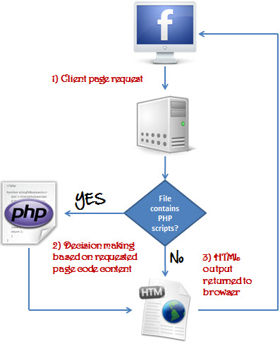

# Server-side languages

  <button class="tablinks active" onclick="openTab(event, 'C-sharp')">ASP.NET (C#)</button>
  <button class="tablinks" onclick="openTab(event, 'PHP')">PHP</button>
    <button class="tablinks" onclick="openTab(event, 'ToDo')">To Do</button>
 

<b>The .NET platform</b>

.NET is a developer platform made up of tools, programming languages, and libraries for building many different types of applications.

The base platform provides components that apply to all different types of apps. Additional frameworks, such as ASP.NET, extend .NET with components for building specific types of apps.

Here are some things included in the .NET platform:

<ul>
<li>The C#, F#, and Visual Basic programming languages</li>
<li>Base libraries for working with strings, dates, files/IO, and more</li>
<li>Editors and tools for Windows, Linux, macOS, and Docker</li>
</ul>

<b>ASP.NET extends .NET</b>

ASP.NET extends the .NET platform with tools and libraries specifically for building web apps.

These are some things that ASP.NET adds to the .NET platform:

<ul>
<li>Base framework for processing web requests in C# or F#</li>
<li>Tools for Web Forms (web-based Windows Forms)</li>
<li>Web-page templating syntax, known as Razor, for building dynamic web pages using C#</li>
<li>Libraries for common web patterns, such as Model View Controller (MVC)</li>
<li>Authentication system that includes libraries, a database, and template pages for handling logins, including multi-factor authentication and external authentication with Google, Twitter, and more.</li>
<li>Editor extensions to provide syntax highlighting, code completion, and other functionality specifically for developing web pages</li>
</ul>

<b>Back-end code</b>

When using ASP.NET your back-end code, such as business logic and data access, is written using C#, F#, or Visual Basic.

Because ASP.NET extends .NET, you can use the large ecosystem of packages and libraries available to all .NET developers. You can also author your own libraries that are shared between any applications written on the .NET platform.

<a href="https://dotnet.microsoft.com/learn/aspnet/what-is-aspnet" target="_new"><em>Reference</em></a>

<b>What is PHP?</b>

PHP is a server side scripting language. that is used to develop Static websites or Dynamic websites or Web applications. PHP stands for Hypertext Pre-processor, that earlier stood for Personal Home Pages.

PHP scripts can only be interpreted on a server that has PHP installed.

The client computers accessing the PHP scripts require a web browser only.

A PHP file contains PHP tags and ends with the extension ".php".

<b>What is a Scripting Language?</b>

A script is a set of programming instructions that is interpreted at runtime.
A scripting language is a language that interprets scripts at runtime. Scripts are usually embedded into other software environments.

The purpose of the scripts is usually to enhance the performance or perform routine tasks for an application.

Server side scripts are interpreted on the server while client side scripts are interpreted by the client application.

PHP is a server side script that is interpreted on the server while JavaScript is an example of a client side script that is interpreted by the client browser. Both PHP and JavaScript can be embedded into HTML pages.

<b>What does PHP stand for?</b>

<ul>
<li>PHP means - Personal Home Page, but it now stands for the recursive backronym PHP: Hypertext Preprocessor.</li>
<li>PHP code may be embedded into HTML code, or it can be used in combination with various web template systems, web content management system and web frameworks.</li>
</ul>

<b>PHP Syntax</b>

A PHP file can also contain tags such as HTML and client side scripts such as JavaScript.

<ul>
<li>HTML is an added advantage when learning PHP Language. You can even learn PHP without knowing HTML but it’s recommended you at least know the basics of HTML.</li>
<li>Database management systems DBMS for database powered applications.</li>
<li>For more advanced topics such as interactive applications and web services, you will need JavaScript and XML.</li>
<li>The flowchart diagram shown below illustrates the basic architecture of a PHP web application and how the server handles the requests.</li>
</ul>

<b>Why use PHP?</b>

You have obviously heard of a number of programming languages out there; you may be wondering why we would want to use PHP as our poison for the web programming. Below are some of the compelling reasons.

<ul>
<li>PHP is open source and free. (ASP.NET is free now too with .NET Core)</li>
<li>Short learning curve compared to other languages such as JSP, ASP etc.</li>
<li>Large community document</li>
<li>Most web hosting servers support PHP by default unlike other languages such as ASP that need IIS. This makes PHP a cost effective choice.</li>
<li>PHP is regular updated to keep abreast with the latest technology trends.</li>
<li>Other benefit that you get with PHP is that it’s a server side scripting language; this means you only need to install it on the server and client computers requesting for resources from the server do not need to have PHP installed; only a web browser would be enough.</li>
<li>PHP has in built support for working hand in hand with MySQL; this doesn’t mean you can’t use PHP with other database management systems. You can still use PHP with</li>
<ul>
<li>Postgres</li>
<li>Oracle</li>
<li>MS SQL Server</li>
<li>ODBC etc.</li>
</ul>
<li>PHP is cross platform; this means you can deploy your application on a number of different operating systems such as windows, Linux, Mac OS etc. (So is ASP.NET with .NET Core)</li>
</ul>

<a href="https://www.guru99.com/what-is-php-first-php-program.html" target="_new"><em>Reference</em></a>

Watch the following videos and answer the questions.

<ul>
<li>Take 10-15 minutes to break out into groups.  Have one person examine ASP.NET (it's okay to lump MVC in there too) and the other PHP.  Find examples where each of these technologies are used.  Why do you think they were used in these situations?  Who has the most market share?  Why is this important?</li>  
<li><a href="https://youtu.be/lE8NdaX97m0?list=PLdo4fOcmZ0oW8nviYduHq7bmKode-p8Wy" data-lity>ASP.NET Video</a></li>
<li><a href="https://youtu.be/KL7_wZSTY6Y"  data-lity>PHP Video</a></li>
<li>Discuss your findings with the class.</li>
</ul>

