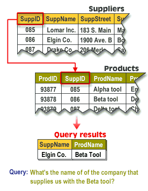

# Linking Tables

## Define

Two tables are linked when they have a matching field, that is, a field in each table containing similar data. For example, suppose you want to link a Suppliers table with another table called Products.

Both tables must have at least one field in common.
If you insert the primary key field of the Suppliers table (for example, SuppID) into the Products table, the two tables will have a matching field: SuppID.
The tables are now linked, and you can access their data together.

## Example

