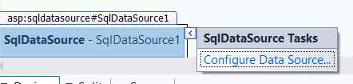
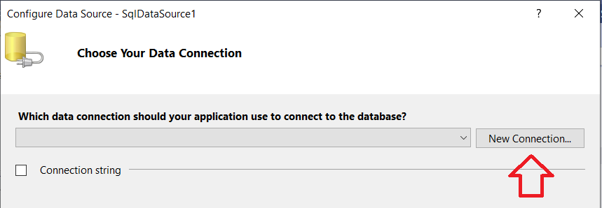
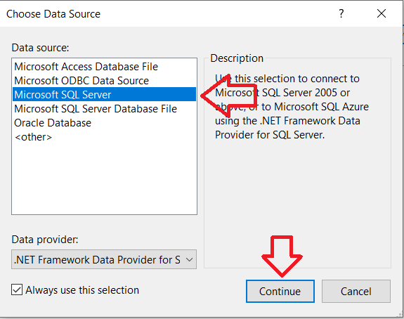
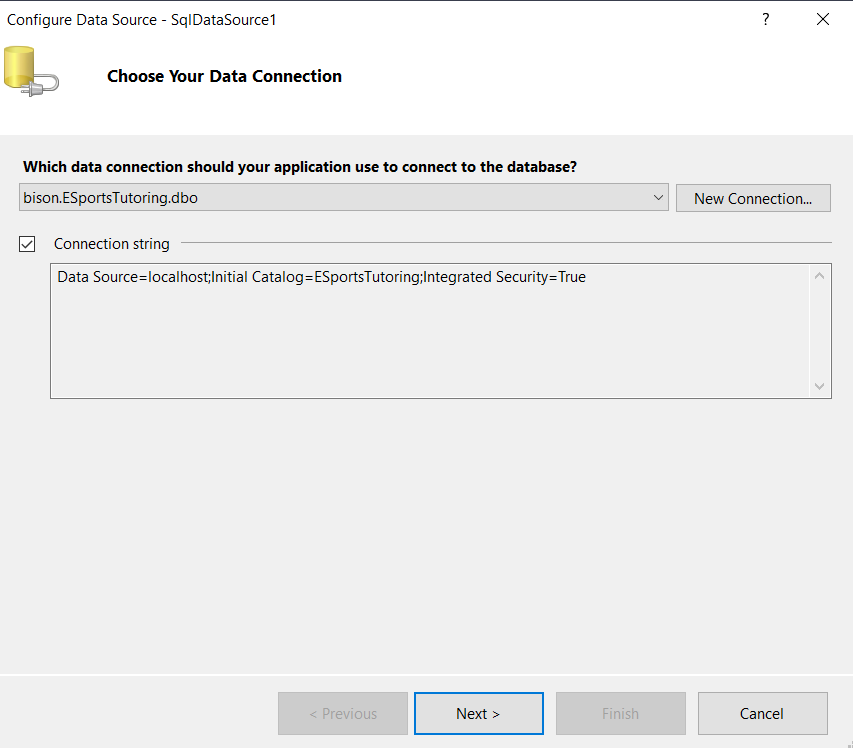
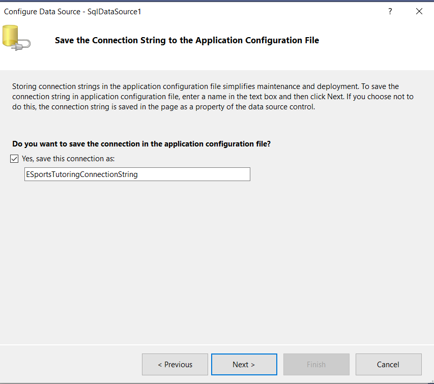
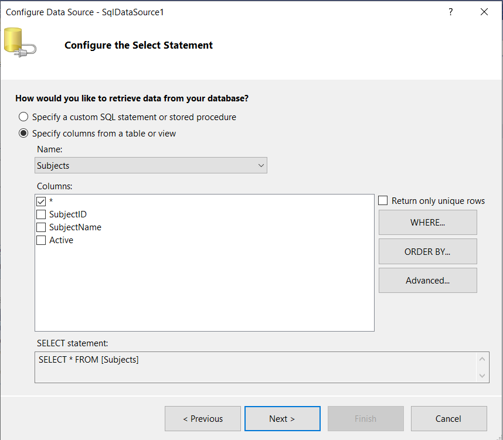
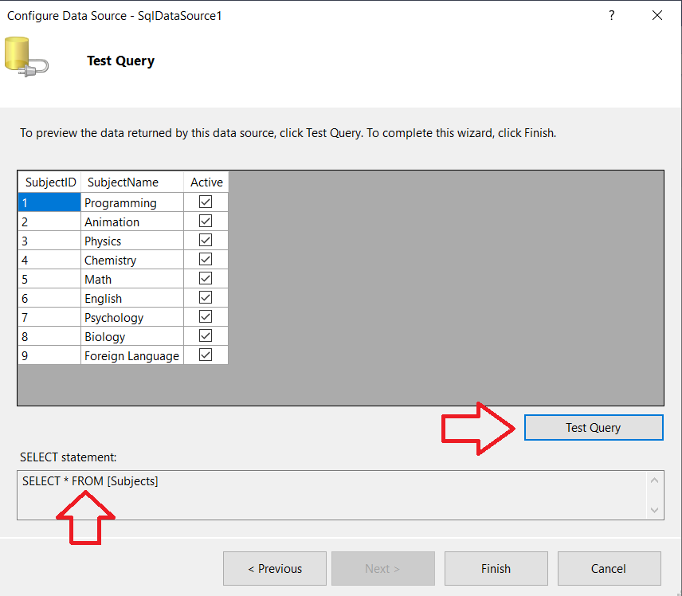
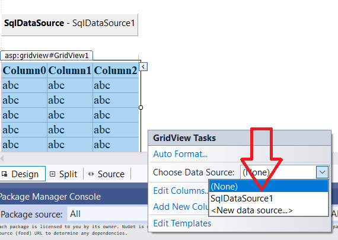
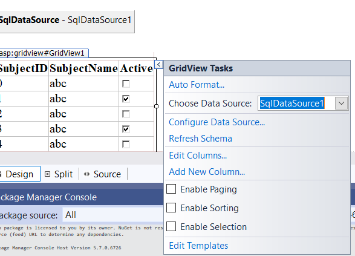
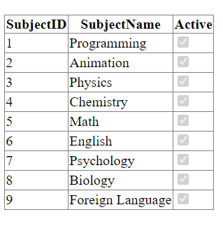

# Built-in Tools

With Visual Studio, you can use their Data Tools to connect, retrieve and display data.

## Visual Studio Tools

First, we want to drag on a sqldatasource component and configure it.

Then, we can select a new connection.

Next, we want to choose SQL Server and connect to it.

For the connection, we will use our localhost, but it could be an external server or a server on your network.  Then, we can connect to a specific database and test the connection.

Then, we can select the connection string that was just created.

We can name the connection string and save it.

Then, we can create all the basic queries as well.

We can test the query to ensure that it returns what we expect.

After dragging in a GridView component, we can connect to the sqldatasrouce that was just configured.

After connecting to the data source, the GridView looks like this.

This is the end result!

