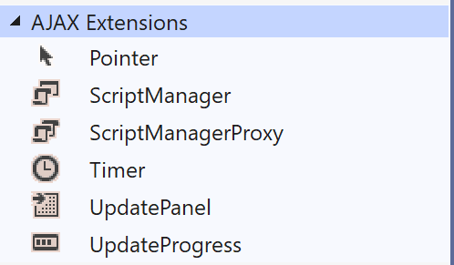

# Toolbox

Let's take a closer look at all the tools in the toolbox.  There are basic HTML controls, but also there are a specific server-side controls as well.  These controls allow us to access the data entered in the code-behind.

## Standard

## Data

## Validation

## AJAX Extensions

## HTML

